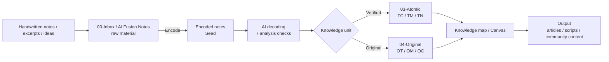

# Wenxi Knowledge Network v2.5

> An Obsidian-based knowledge workflow that separates verified knowledge from original ideas.
>
> Zhongtuike Technology · Wenxi AI Community


## Overview

Wenxi Knowledge Network v2.5 is a complete Obsidian knowledge management system built around an encode, decode, and atomize workflow.

It helps you:

- Keep raw notes out of the formal note system until they are encoded
- Separate verified knowledge from your original concepts and frameworks
- Organize notes with 7 discipline codes: `LE/DK/AP/CE/PA/LT/XX`
- Maintain a concept registry and detect duplicates
- Check and repair ghost links
- Advance note status from `Seed` to `Sprout` to `Mature`



## Core Features

1. **Raw-to-formal workflow**: raw fragments first go to `00-Inbox` or `AI融合笔记`; only confirmed material becomes an encoded note.
2. **Verified vs original separation**: `03-Atomic` stores verified knowledge; `04-原创` stores your original terms, models, and concepts.
3. **Three-layer organization**: library -> form -> discipline.
4. **Six prefixes**: `TC/TM/TN` for verified knowledge and `OT/OM/OC` for original knowledge.
5. **7 analysis checks**: decoding uses a checklist, not a confusing “dimension” system.
6. **Bidirectional knowledge network**: source links, derived-note links, and horizontal links keep knowledge traceable.

## Recommended Reading Path

| Goal | Start Here |
|---|---|
| Understand the whole system | [Visual Guide](docs/知识库视觉导览.md) |
| Create a vault quickly | [Quick Start](#quick-start) |
| Check naming, status, and classification rules | [FAQ](docs/FAQ.md) |
| Configure the AI workflow | [SKILL v2.5](docs/SKILL-v2_5.md) |
| Read the full guide | [Wenxi Knowledge Network v2.5 Guide](docs/文希知识网络v2.5完整说明与使用指南.md) |

## Quick Start

### Requirements

- Python 3.7+
- PyYAML
- Obsidian
- Git

### 1. Clone the Repository

```bash
git clone https://github.com/vincci-wenxi/vincci-knowledge-network.git
cd vincci-knowledge-network
```

### 2. Install Dependencies

```bash
pip install -r requirements.txt
```

### 3. Create the Vault Structure

Edit `setup-vault.sh` and set `VAULT_ROOT` to your target vault path:

```bash
# In setup-vault.sh
VAULT_ROOT="$HOME/Wenxi Knowledge Network"

bash setup-vault.sh
```

### 4. Configure Paths

Copy the config template and update `vault_root`:

```bash
cp config-template.yaml .knowledge-network-config.yaml
# Edit .knowledge-network-config.yaml and set paths.vault_root
```

### 5. Configure the AI Workflow Optional

```bash
mkdir -p .claude/skills
cp docs/SKILL-v2_5.md .claude/skills/knowledge-network-workflow.md
```

## Directory Structure

The generated vault uses Chinese directory names because this workflow is designed for a Chinese Obsidian environment.

```text
<vault-root>/
├── 编码笔记/                   # structured notes generated after @编码
├── 解码笔记/                   # AI decoding notes with 7 analysis checks
├── Obsidian Vault/
│   ├── 00-Inbox/              # raw notes / inbox
│   ├── 01-Projects/           # PARA projects
│   ├── 02-Areas/              # PARA areas
│   ├── 03-Atomic/             # verified knowledge
│   │   ├── TC-术语/
│   │   ├── TM-思维模型/
│   │   └── TN-概念/
│   ├── 04-原创/               # original knowledge created by the user
│   │   ├── OT-原创术语/
│   │   ├── OM-原创思维模型/
│   │   └── OC-原创概念/
│   ├── 05-Resources/
│   ├── 06-参考资料/
│   ├── 07-System/
│   │   └── concept-registry.yaml
│   ├── 08-Daily/
│   ├── 09-MOC/
│   ├── 10-MAP/
│   ├── 11-Data/
│   └── AI融合笔记/
├── Output/
├── Business/
├── .claude/skills/
└── .knowledge-network-config.yaml
```

## Scripts

### `kn_common.py`

Shared utilities for config loading, frontmatter handling, filename parsing, and note scanning.

### `kn_dedup.py`

Duplicate detection and concept registry synchronization.

```bash
# Scan duplicates across verified and original libraries
python scripts/kn_dedup.py --vault <vault-root> scan

# Check whether a concept already exists
python scripts/kn_dedup.py --vault <vault-root> check --concept "symbolic violence"

# Rebuild the concept registry
python scripts/kn_dedup.py --vault <vault-root> sync-registry --apply
```

### `kn_links.py`

Ghost link detection and repair.

```bash
# Check ghost links
python scripts/kn_links.py --vault <vault-root> check

# Apply automatic fixes
python scripts/kn_links.py --vault <vault-root> fix --apply
```

### `kn_status.py`

Status machine for encoded notes.

```bash
# Preview pending status transitions
python scripts/kn_status.py --vault <vault-root> check

# Apply status transitions
python scripts/kn_status.py --vault <vault-root> advance --apply
```

Run maintenance scripts without `--apply` first to preview changes, then rerun with `--apply` after reviewing the output.

## Naming Rules

### Encoded Notes

```text
CODE-YYYYMMDD-SEQ@TYPE-title.md
Example: DK-20250510-001@v1-reading-notes.md
```

### Atomic Notes Verified Knowledge

```text
PREFIX-CODE-concept.md
Examples:
TC-CE-symbolic-violence.md
TM-DK-first-principles.md
TN-CE-cognitive-dissonance.md
```

### Original Notes

```text
PREFIX-CODE-concept.md
Examples:
OT-CE-original-term.md
OM-CE-two-sided-analysis-framework.md
OC-CE-framework-awareness.md
```

## Abbreviations

### Discipline Codes

| Code | Area |
|:---:|------|
| LE | Life Experience |
| DK | Discipline Knowledge |
| AP | Artistic Perception |
| CE | Cognitive Evolution |
| PA | Practical Activity |
| LT | Literature |
| XX | Interdisciplinary |

### Prefixes

**Verified Knowledge**

| Prefix | Form | Meaning |
|:---:|------|------|
| TC | Term | Verified Term Card |
| TM | Thinking Model | Verified Thinking Model |
| TN | Concept | Verified Concept |

**Original Knowledge**

| Prefix | Form | Meaning |
|:---:|------|------|
| OT | Original Term | Original Term |
| OM | Original Model | Original Thinking Model |
| OC | Original Concept | Original Concept |

## Documentation

- [Chinese README](README_CN.md)
- [Wenxi Knowledge Network v2.5 Guide](docs/文希知识网络v2.5完整说明与使用指南.md)
- [Visual Guide](docs/知识库视觉导览.md)
- [SKILL v2.5](docs/SKILL-v2_5.md)
- [FAQ](docs/FAQ.md)

## Contributing

Issues and pull requests are welcome.

## License

MIT License

## Contact

- Zhongtuike Technology · Wenxi AI Community
- AI Companion Circle

---

Verified knowledge stays verified. Original ideas stay original. Let knowledge grow with structure.
