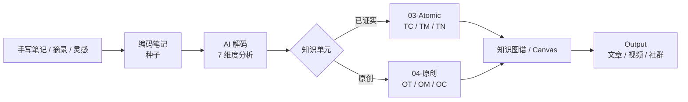

# 文希知识网络 v2.5

> Obsidian 知识管理系统 — 原子笔记（已证实）与原创库（新创）分离版
> 
> 众推客科技 · 文希AI社区 · #AI搭子圈


## 📖 项目简介

这是一套完整的 Obsidian 知识库管理系统，实现了：

- ✅ **编码-解码-原子化** 三段式知识加工流程
- ✅ **原子笔记与原创库物理分离**（已证实 vs 新创）
- ✅ **7学科分类体系**（LE/DK/AP/CE/PA/LT/XX）
- ✅ **自动去重与概念注册表**
- ✅ **幽灵链接检测与修复**
- ✅ **状态机自动流转**（种子→萌芽→成熟）



### 核心特性

1. **原子笔记与原创库分离**：已被证实的知识（TC/TM/TN）与你的原创内容（OT/OM/OC）物理分离
2. **三层分类体系**：库归属 → 形态 → 学科，清晰的知识组织结构
3. **6种PREFIX**：`TC/TM/TN`（已证实） + `OT/OM/OC`（原创），一目了然
4. **编码-解码-原子化**：三段式知识加工流程，从信息到知识的系统化转化
5. **去景观化约束**：AI 输出必须可操作、可验证，拒绝空洞套话
6. **双向链接网络**：自动建立知识关联，形成你的认知图谱

### 推荐阅读路径

| 目标 | 入口 |
|---|---|
| 先看懂系统全貌 | [知识库视觉导览](docs/知识库视觉导览.md) |
| 马上创建知识库 | [快速开始](#-快速开始) |
| 查命名、状态、分类规则 | [常见问题](docs/FAQ.md) |
| 配置 AI 工作流 | [SKILL工作流v2.5](docs/SKILL-v2_5.md) |

## 🚀 快速开始

### 前置要求

- Python 3.7+
- PyYAML
- Obsidian
- Git

### 安装步骤

#### 1. 克隆仓库

```bash
git clone https://github.com/vincci-wenxi/vincci-knowledge-network.git
cd vincci-knowledge-network
```

#### 2. 安装依赖

```bash
pip install -r requirements.txt
```

#### 3. 创建知识库结构

```bash
# 修改 setup-vault.sh 中的目标路径（第6行）
# VAULT_ROOT="你的知识库根目录路径"

bash setup-vault.sh
```

#### 4. 配置路径

复制配置模板并编辑：

```bash
cp config-template.yaml .knowledge-network-config.yaml
# 编辑 .knowledge-network-config.yaml，填入你的 vault_root 路径
```

#### 5. 配置 Claude/AI 工作流（可选）

```bash
mkdir -p .claude/skills
cp docs/SKILL-v2_5.md .claude/skills/knowledge-network-workflow.md
```

## 📁 目录结构

```
文希知识网络/
├── 编码笔记/                   # 手写/摘录，按7学科分类
├── 解码笔记/                   # AI 7维度解码
├── Obsidian Vault/
│   ├── 00-Inbox/              # 未整理笔记 / 收件箱
│   ├── 01-Projects/           # PARA 项目
│   ├── 02-Areas/              # PARA 领域
│   ├── 03-Atomic/             # 原子笔记（已证实）
│   │   ├── TC-术语/
│   │   ├── TM-思维模型/
│   │   └── TN-概念/
│   ├── 04-原创/               # 原创库（用户新创）
│   │   ├── OT-原创术语/
│   │   ├── OM-原创思维模型/
│   │   └── OC-原创概念/
│   ├── 05-Resources/
│   ├── 06-参考资料/
│   ├── 07-System/
│   │   └── concept-registry.yaml
│   ├── 08-Daily/
│   ├── 09-MOC/
│   ├── 10-MAP/
│   ├── 11-Data/
│   └── AI融合笔记/
├── Output/
├── Business/
├── .claude/skills/
└── .knowledge-network-config.yaml
```

## 🛠️ 脚本工具

### kn_common.py

共享工具库，提供配置加载、frontmatter 读写、文件扫描等功能。

### kn_dedup.py

原子笔记去重检测与概念注册表同步。

```bash
# 扫描全库重复
python scripts/kn_dedup.py --vault <知识库根目录> scan

# 检查概念是否存在
python scripts/kn_dedup.py --vault <知识库根目录> check --concept 符号暴力

# 重建概念注册表
python scripts/kn_dedup.py --vault <知识库根目录> sync-registry --apply
```

### kn_links.py

幽灵链接（断链）检测与修复。

```bash
# 检查幽灵链接
python scripts/kn_links.py --vault <知识库根目录> check

# 自动修复
python scripts/kn_links.py --vault <知识库根目录> fix --apply
```

### kn_status.py

编码笔记状态机自动流转。

```bash
# 检查待流转的笔记
python scripts/kn_status.py --vault <知识库根目录> check

# 执行状态流转
python scripts/kn_status.py --vault <知识库根目录> advance --apply
```

## 📝 命名规范

### 编码笔记

```
CODE-YYYYMMDD-SEQ@TYPE-标题.md
例：DK-20250510-001@v1-读书笔记.md
```

### 原子笔记（已证实）

```
PREFIX-CODE-概念名.md
例：TC-CE-符号暴力.md
    TM-DK-第一性原理.md
    TN-CE-认知失调.md
```

### 原创笔记

```
PREFIX-CODE-概念名.md
例：OT-CE-新术语.md
    OM-CE-AB面分析框架.md
    OC-CE-框架觉知.md
```

## 🔤 缩写速查

### 学科编码（7类）

| 缩写 | 中文 | English |
|:---:|------|---------|
| LE | 人生体验 | Life Experience |
| DK | 学科知识 | Discipline Knowledge |
| AP | 艺术感知 | Artistic Perception |
| CE | 认知进化 | Cognitive Evolution |
| PA | 实践活动 | Practical Activity |
| LT | 文学创作 | Literature |
| XX | 交叉学科 | Interdisciplinary |

### PREFIX（形态标识）

**已证实（Verified/Trusted）**

| 缩写 | 形态 | 含义 |
|:---:|------|------|
| TC | 术语 | Verified Term Card |
| TM | 思维模型 | Verified Thinking Model |
| TN | 概念 | Verified Concept |

**原创（Original）**

| 缩写 | 形态 | 含义 |
|:---:|------|------|
| OT | 原创术语 | Original Term |
| OM | 原创思维模型 | Original Model |
| OC | 原创概念 | Original Concept |

## 📚 文档

- [v2.5完整说明与使用指南](docs/文希知识网络v2.5完整说明与使用指南.md)
- [知识库视觉导览](docs/知识库视觉导览.md)
- [SKILL工作流v2.5](docs/SKILL-v2_5.md)
- [常见问题](docs/FAQ.md)

## 🤝 贡献

欢迎提交 Issue 和 Pull Request！

## 📄 许可证

MIT License

## 👥 联系方式

- 众推客科技 · 文希AI社区
- #AI搭子圈

---

**让知识有序生长，已证实归已证实，原创归原创。**
