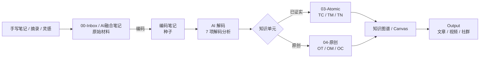
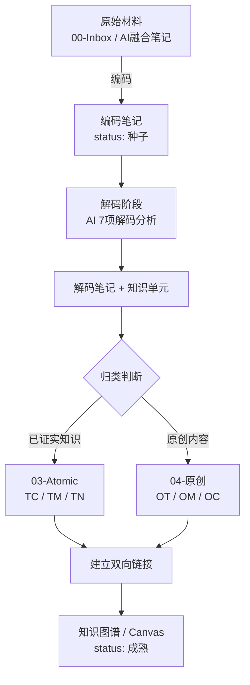

# 📚 文希知识网络 v2.5 - 完整使用指南

## 🎯 项目简介

这是一个完整的 **Obsidian 知识管理系统**，实现了编码-解码-原子化的三段式知识加工流程。



### 核心特色

🌟 **原子笔记与原创库分离** - 已证实的知识与原创概念物理隔离  
📝 **7学科分类体系** - LE/DK/AP/CE/PA/LT/XX 完整覆盖  
🤖 **AI辅助工作流** - 从编码到知识图谱全流程支持  
🔧 **Python自动化工具** - 去重、修链、状态流转一键完成  
📖 **完善的文档** - 17 个 FAQ + 详细教程

### 先看哪一份

| 你想做什么 | 推荐入口 |
|---|---|
| 先看懂这套系统怎么运转 | [知识库视觉导览](docs/知识库视觉导览.md) |
| 直接创建 Obsidian 知识库 | [10分钟快速开始](#-10分钟快速开始) |
| 查命名、状态、分类规则 | [FAQ](docs/FAQ.md) |
| 给 AI 配置完整工作流 | [SKILL-v2_5.md](docs/SKILL-v2_5.md) |

---

## 🚀 10分钟快速开始

### 准备工作

```bash
# 确认 Python 版本
python3 --version  # 需要 3.7+

# 克隆项目
git clone https://github.com/vincci-wenxi/vincci-knowledge-network.git
cd vincci-knowledge-network

# 安装依赖
pip3 install -r requirements.txt
```

### 创建知识库

```bash
# 1. 编辑建库脚本，修改目标路径（第6行）
nano setup-vault.sh
# 将 VAULT_ROOT="$HOME/文希知识网络" 改为你想要的路径

# 2. 运行建库脚本
bash setup-vault.sh

# 3. 配置路径
cp config-template.yaml .knowledge-network-config.yaml
nano .knowledge-network-config.yaml  # 填入你的 vault_root
```

### 用 Obsidian 打开

1. 启动 Obsidian
2. 打开文件夹：选择你在上面设置的 `VAULT_ROOT` 路径
3. 开始记录你的第一条笔记！

---

## 📁 目录结构一览

```
文希知识网络/
├── 编码笔记/          📝 @编码 后生成的结构化笔记
│   ├── 01-LE-人生体验/
│   ├── 02-DK-学科知识/
│   ├── 03-AP-艺术感知/
│   ├── 04-CE-认知进化/
│   ├── 05-PA-实践活动/
│   ├── 06-LT-文学创作/
│   └── 07-XX-交叉学科/
│
├── 解码笔记/          🔍 AI解码分析
│   └── （镜像7学科）
│
├── Obsidian Vault/
│   ├── 00-Inbox/      📥 未整理笔记 / 收件箱
│   ├── 01-Projects/   📌 PARA 项目
│   ├── 02-Areas/      🧭 PARA 领域
│   │
│   ├── 03-Atomic/     ⚛️ 原子笔记（已证实）
│   │   ├── TC-术语/
│   │   ├── TM-思维模型/
│   │   └── TN-概念/
│   │
│   ├── 04-原创/       💡 原创库（你的创造）
│   │   ├── OT-原创术语/
│   │   ├── OM-原创思维模型/
│   │   └── OC-原创概念/
│   │
│   ├── 05-Resources/  📚 外部资料
│   ├── 06-参考资料/
│   ├── 07-System/
│   │   └── concept-registry.yaml  📋 概念注册表
│   ├── 08-Daily/
│   ├── 09-MOC/
│   ├── 10-MAP/
│   ├── 11-Data/
│   └── AI融合笔记/
│
└── Output/            📤 可发布内容
```

---

## 🛠️ 工具脚本速查

### 去重检测

```bash
# 扫描全库，查找重复概念
python scripts/kn_dedup.py --vault ~/文希知识网络 scan

# 检查单个概念是否已存在
python scripts/kn_dedup.py --vault ~/文希知识网络 check --concept 符号暴力

# 重建概念注册表（先预览）
python scripts/kn_dedup.py --vault ~/文希知识网络 sync-registry

# 确认无误后写入
python scripts/kn_dedup.py --vault ~/文希知识网络 sync-registry --apply
```

### 链接修复

```bash
# 检查幽灵链接（断链）
python scripts/kn_links.py --vault ~/文希知识网络 check

# 自动修复
python scripts/kn_links.py --vault ~/文希知识网络 fix --apply
```

### 状态管理

```bash
# 检查可流转的笔记
python scripts/kn_status.py --vault ~/文希知识网络 check

# 自动流转状态（种子→萌芽→成熟）
python scripts/kn_status.py --vault ~/文希知识网络 advance --apply
```

---

## 📝 命名规范速查

### 编码笔记

```
格式：CODE-YYYYMMDD-SEQ@TYPE-标题.md
示例：DK-20250510-001@v1-读《思考快与慢》笔记.md
```

| 部分 | 说明 | 示例 |
|------|------|------|
| CODE | 学科代码 | DK, CE, LE... |
| YYYYMMDD | 创建日期 | 20250510 |
| SEQ | 当日序号 | 001 |
| TYPE | 版本类型 | v1, draft, final |

### 原子笔记（已证实）

```
格式：PREFIX-CODE-概念名.md
示例：TC-CE-符号暴力.md
```

| PREFIX | 含义 | 示例 |
|--------|------|------|
| TC | 已证实术语 | TC-CE-符号暴力.md |
| TM | 已证实思维模型 | TM-DK-第一性原理.md |
| TN | 已证实概念 | TN-CE-认知失调.md |

### 原创笔记

```
格式：PREFIX-CODE-概念名.md
示例：OC-CE-框架觉知.md
```

| PREFIX | 含义 | 示例 |
|--------|------|------|
| OT | 原创术语 | OT-CE-新术语.md |
| OM | 原创思维模型 | OM-CE-AB面分析.md |
| OC | 原创概念 | OC-CE-框架觉知.md |

---

## 🔤 学科代码速查

| 代码 | 中文 | English |
|:---:|------|---------|
| LE | 人生体验 | Life Experience |
| DK | 学科知识 | Discipline Knowledge |
| AP | 艺术感知 | Artistic Perception |
| CE | 认知进化 | Cognitive Evolution |
| PA | 实践活动 | Practical Activity |
| LT | 文学创作 | Literature |
| XX | 交叉学科 | Interdisciplinary |

---

## 🔄 工作流程图



更完整的思维导图、决策树和 Obsidian 可视化建议见 [知识库视觉导览](docs/知识库视觉导览.md)。

---

## 💡 最佳实践

### 每日流程

**早晨** ☀️
- 把新想法、读书摘录、碎片材料先放入 `Obsidian Vault/00-Inbox/`
- AI 原始输出或对话记录先放入 `Obsidian Vault/AI融合笔记/`
- 需要进入正式体系时，再运行 `@编码` 生成 `编码笔记/`

**下午** 🌤️
- 运行 AI 解码分析
- 审阅提取的概念

**晚上** 🌙
- 运行维护脚本
- 检查重复和链接

### 每周维护

**周末** 🎯
- 运行 `@知识图谱` 建立联系
- 归档过时内容
- 备份概念注册表

---

## 📚 详细文档

| 文档 | 内容 |
|------|------|
| [SKILL-v2_5.md](docs/SKILL-v2_5.md) | 完整工作流规范 |
| [文希知识网络v2.5完整说明与使用指南.md](docs/文希知识网络v2.5完整说明与使用指南.md) | 系统优势、完整文件架构、脚本用法与落地清单 |
| [FAQ.md](docs/FAQ.md) | 17 个常见问题解答 |
| [知识库视觉导览](docs/知识库视觉导览.md) | 流程图、思维导图、命名拆解与可视化建议 |
| [GITHUB_SETUP.md](GITHUB_SETUP.md) | GitHub 上传指南 |

---

## ❓ 快速答疑

<details>
<summary><b>Q: 什么算"已证实"，什么算"原创"？</b></summary>

**已证实**：有权威学术来源、被广泛验证（如：符号暴力、第一性原理）  
**原创**：你自己创造的概念、方法论（如：你的AB面分析框架）

AI 拿不准时会询问你。

</details>

<details>
<summary><b>Q: 脚本安全吗？会覆盖我的文件吗？</b></summary>

安全！所有脚本默认 **dry-run 模式**（预览）：
- 不加 `--apply` = 只报告，不写盘
- 加 `--apply` = 真正修改

建议：首次运行先不加 `--apply`，确认无误再加。

</details>

<details>
<summary><b>Q: 遇到问题怎么办？</b></summary>

1. 查看 [FAQ.md](docs/FAQ.md)
2. 提交 [GitHub Issue](https://github.com/vincci-wenxi/vincci-knowledge-network/issues)
3. 加入文希AI社区讨论

</details>

---

## 🤝 贡献

欢迎贡献！请查看 [CONTRIBUTING.md](CONTRIBUTING.md)

### 如何贡献

1. Fork 本项目
2. 创建特性分支 (`git checkout -b feature/amazing-feature`)
3. 提交改动 (`git commit -m 'feat: 添加某某功能'`)
4. 推送到分支 (`git push origin feature/amazing-feature`)
5. 开启 Pull Request

---

## 📄 许可证

MIT License © 2026 众推客科技 · 文希AI社区

---

## 🌟 Star History

如果这个项目对你有帮助，请给个 Star ⭐

---

## 📞 联系我们

- 众推客科技
- 文希AI社区
- #AI搭子圈

---

**让知识有序生长，已证实归已证实，原创归原创。** 🌱
