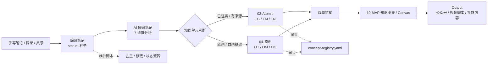
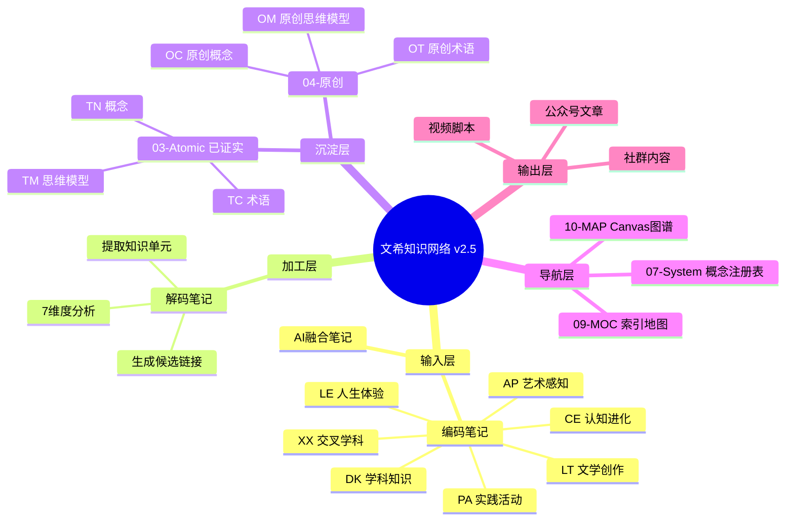
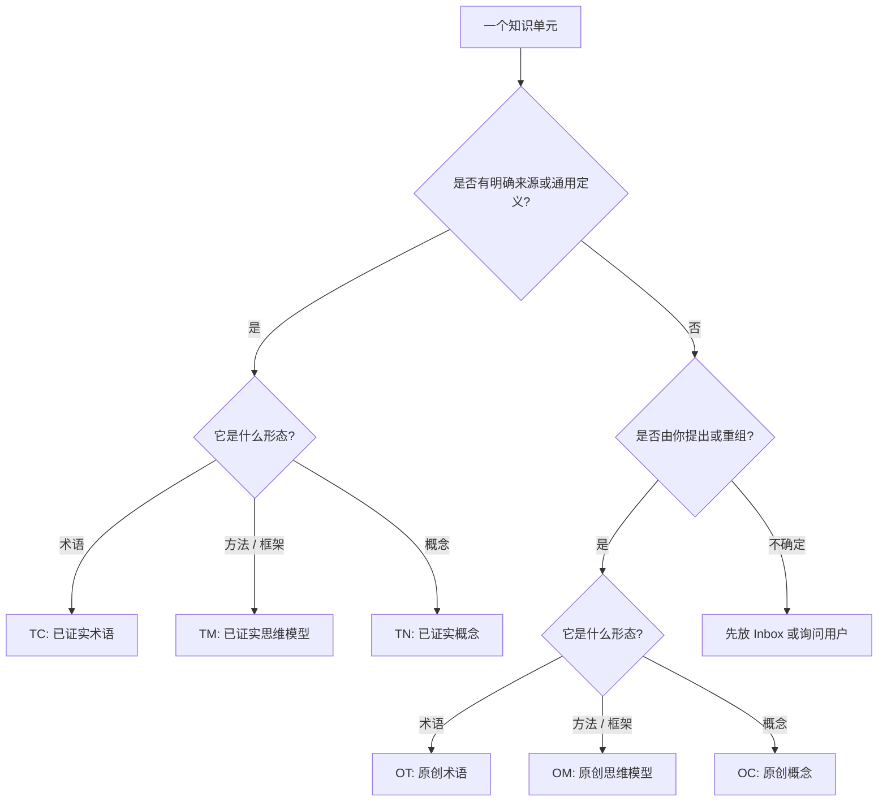
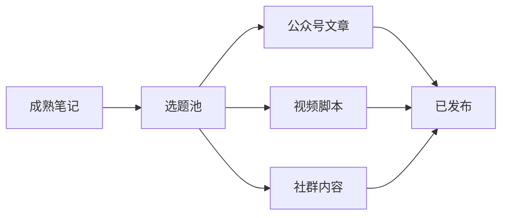
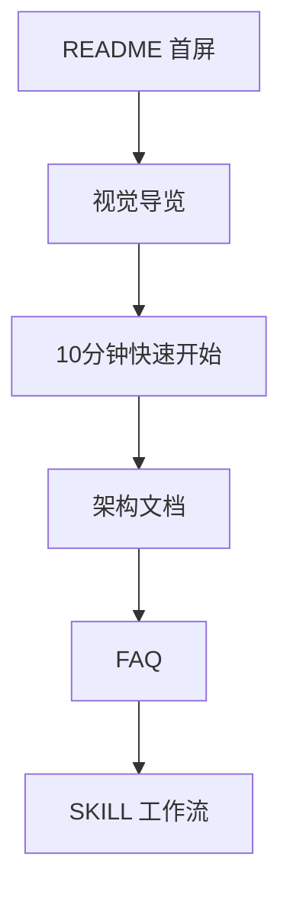

# 文希知识网络 v2.5 视觉导览

> 目标：把纯文本的知识库规则，变成可以一眼看懂的知识地图。

这份导览适合放在 README 之后阅读，也适合复制到 Obsidian 首页、MOC 页面或 Canvas 旁边，作为新用户的第一张地图。

---

## 一、知识从哪里来，到哪里去



阅读顺序建议：

1. 先看输入：`编码笔记/` 负责收集原始材料。
2. 再看加工：`解码笔记/` 负责把材料拆成知识单元。
3. 最后看沉淀：`03-Atomic/` 和 `04-原创/` 分别存放已证实知识与原创知识。

---

## 二、知识库总览思维导图



---

## 三、03-Atomic 与 04-原创怎么选

| 判断问题 | 去向 | 文件前缀 | 例子 |
|---|---|---|---|
| 有明确学术来源、行业定义或广泛验证吗？ | `03-Atomic/` | `TC` / `TM` / `TN` | 符号暴力、第一性原理、认知失调 |
| 是你自己提出的新词、新框架或新概念吗？ | `04-原创/` | `OT` / `OM` / `OC` | 框架觉知、AB面分析框架 |
| AI 拿不准是已有知识还是原创知识吗？ | 暂停归类，询问用户 | 待确认 | 不自动混放 |



---

## 四、命名规则拆解

把文件名拆成三个稳定部分：

```text
TC-CE-符号暴力.md
│  │  └─ 概念名：知识单元的清晰名称
│  └──── 学科代码：CE = 认知进化
└─────── 形态前缀：TC = 已证实术语
```

常用组合：

| 前缀 | 归属 | 形态 | 示例 |
|---|---|---|---|
| `TC` | 已证实 | 术语 | `TC-CE-符号暴力.md` |
| `TM` | 已证实 | 思维模型 | `TM-DK-第一性原理.md` |
| `TN` | 已证实 | 概念 | `TN-CE-认知失调.md` |
| `OT` | 原创 | 术语 | `OT-CE-新术语.md` |
| `OM` | 原创 | 思维模型 | `OM-CE-AB面分析框架.md` |
| `OC` | 原创 | 概念 | `OC-CE-框架觉知.md` |

---

## 五、把 Obsidian 变得不干巴的 5 个方向

### 1. 首页做成仪表盘

建议在 Obsidian 根目录放一个 `README` 或 `Home` 笔记，包含：

- 今日入口：新建编码笔记、查看待解码笔记、运行维护脚本。
- 状态看板：种子、萌芽、成熟、归档。
- 快速地图：Atomic、原创、MOC、Output。

### 2. 每个学科做 MOC

为 7 个学科各建一个索引页：

- `MOC-LE-人生体验.md`
- `MOC-DK-学科知识.md`
- `MOC-CE-认知进化.md`

每个 MOC 只回答三个问题：这个学科沉淀了什么、最近新增了什么、最值得继续追的链接是什么。

### 3. 用 Canvas 展示主路径

Canvas 不需要覆盖所有笔记，先做三张核心图：

- `知识加工总图.canvas`
- `已证实 vs 原创.canvas`
- `7学科知识地图.canvas`

### 4. 给模板加视觉块

模板里可以固定放这些区块：

- `一句话定义`
- `来源 / 证据`
- `相关概念`
- `可输出场景`
- `下一步链接`

### 5. 输出区按内容形态组织

`Output/` 不只是归档，可以做成发布流水线：



---

## 六、建议的 README 阅读路径



README 负责让人快速理解，详细文档负责让人准确执行。这样项目会更像一套知识产品，而不是一堆规则文本。
